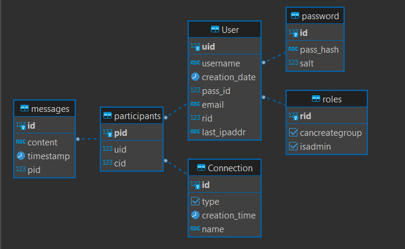

# **Database Documentation**

The database is based on postgresql and is in 3rd normal form.

## User Table

...

## Pass Table

The password table is serrated and each password is salted.

## Role Table

...

## Connection table

...

## Participants Table

...

## Messages Table

...
