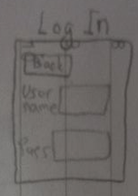
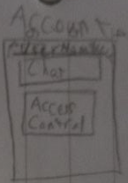
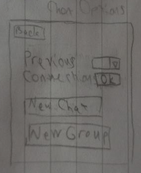
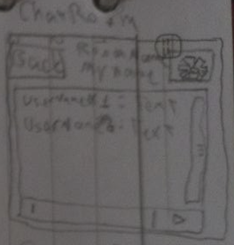
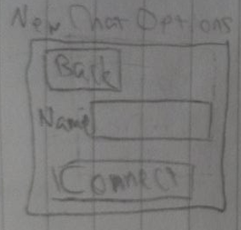
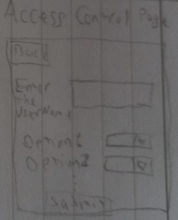

# **Front-End Documentation**

The front end of the chatroom will be implementation using python with the help of **Pysimplegui** library.  
This documentation provides an overview and explanation.  

## Home

2 buttons , Sign in takes you to the sign in page the other should take you to the login page

## Login

Has 2 text input fields , one for username one for password and a submit button. If the response is okay the app proceeds to the Account page. Otherwise the error response from server should be displayed via a pop.

## Sign

Has 4 text input fields and a submit button :  

- Email
- Username
- Pass
- Confirm Pass

The quality of the password(length, presence of numeric and alphabetic characters, ...) are checked locally. Uniqueness of email will be checked by server
When local regulations are met, **a public-private key pair is made and the public one is sent to the server along the user data and the private one is saved locally using [<u>dotnev</u>](https://blog.zanalytics.io/using-env-to-securely-store-authentication-keys-in-python-58489da7b248?gi=fe6bd050b273) library**.
. Any problems with signin is shown via a pop message or else the app sends the data and proceeds to the account page.

## Account

Has two buttons:

- Chat Options
- Access Control

Each proceeds to its dedicated page.
If the user is not allowed any access control , the indicating response of the server is shown respectively.

## ChatOptions

When the Chat Option button in the Account page is activated, the list of user's connections is provided in the response.
This list is displayed via a dropdown list. When the one is selected and the connect button is activated, the app proceeds to the chatroom page.
There are two other buttons one for creating private chat connection and one for creating a group chat.

## Chatroom

## NewChatOptions

Takes the username of the one whom is wished to be connected to.
If there is no match with the server records of usernames or there is match with the server records of connections the respective server response is shown via a pop up or else the initialization of the connection happens.
As mentioned in the project definition, the public key of the user is requested and saved using [<u>dotnev</u>](https://blog.zanalytics.io/using-env-to-securely-store-authentication-keys-in-python-58489da7b248?gi=fe6bd050b273).And then proceeds to then the app chatroom page.

## AccessControlPage

