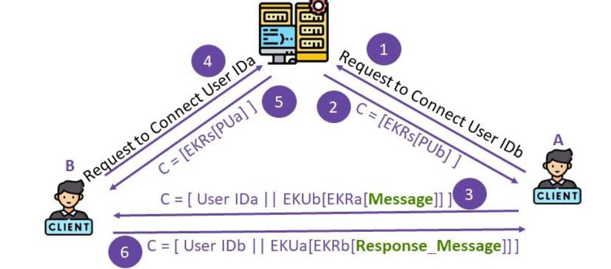
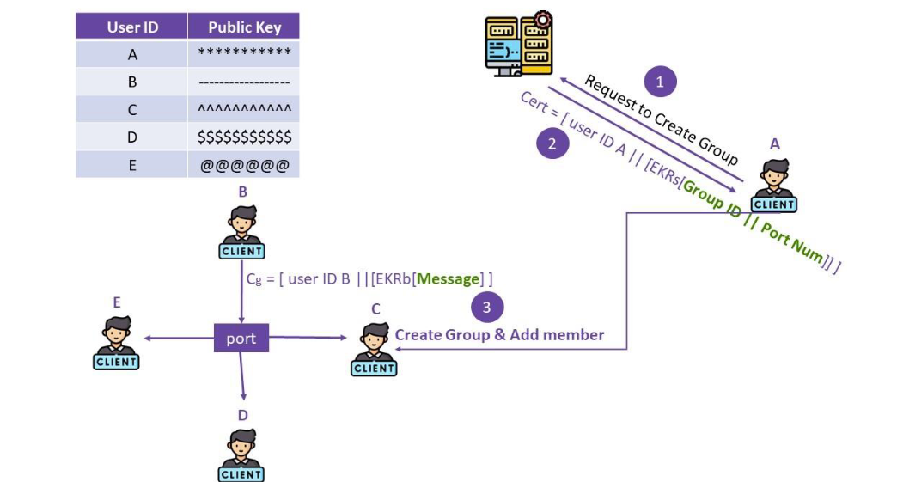

# **Secure Chat Project**  

## *For the course "Fundamentals of Secure Computation"*

This project implements the fundamentals concepts of secure computing in a simple chat room application.
This application supports private chat and group chat.

## **Private**  

## **Group**  

